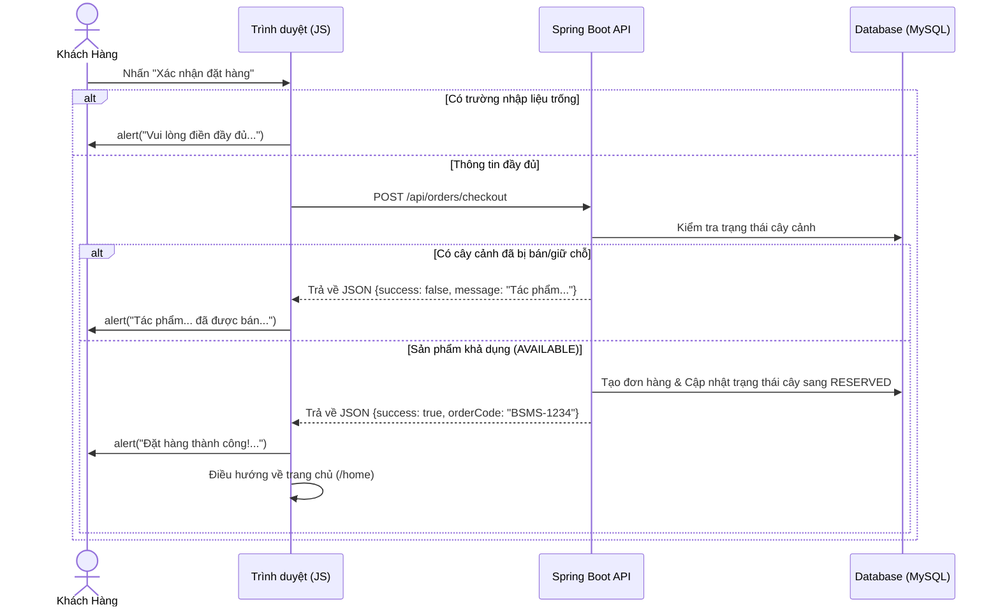
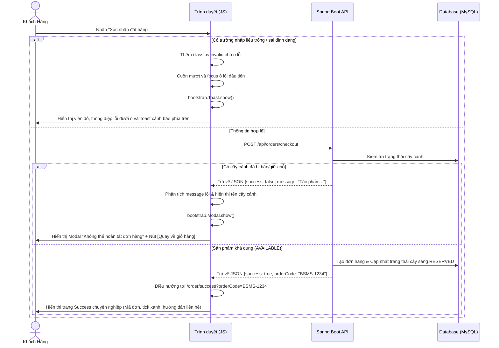

# Hướng Dẫn Tái Cấu Trúc Thông Báo Trang Thanh Toán (Checkout Notification Refactor)

Tài liệu này đóng vai trò như một cẩm nang thiết kế kỹ thuật (Technical Design) và hướng dẫn triển khai (Implementation Guide) chi tiết cho việc nâng cấp trải nghiệm phản hồi (Notification/Feedback) trong luồng thanh toán (Checkout) của dự án Bonsai Shop Management System (BSMS).

---

## 1. Mục tiêu refactor
Mục tiêu chính là thay thế hoàn toàn cơ chế thông báo mặc định bằng hàm `alert()` của trình duyệt ở trang thanh toán `/checkout` bằng giao diện người dùng trực quan, hiện đại và thân thiện hơn (UX/UI chuyên nghiệp):
- **Validate phía Client**: Thay vì một hộp thoại `alert()` khô khan báo lỗi chung chung, hệ thống sẽ thực hiện xác thực trực tiếp trên từng trường dữ liệu nhập (Họ tên, SĐT, Email, Địa chỉ) bằng màu viền đỏ cảnh báo, hiển thị văn bản hướng dẫn cụ thể dưới trường lỗi, tập trung con trỏ (focus) vào ô lỗi đầu tiên và hiển thị Toast nhắc nhở ở phía trên.
- **Lỗi Nghiệp vụ (Business Error)**: Các lỗi do trạng thái cây cảnh bị thay đổi đột ngột từ máy chủ (ví dụ: đã có khách hàng khác mua hoặc đặt giữ chỗ trước) sẽ hiển thị thông qua cấu trúc **Modal** Bootstrap 5 đồng bộ, cung cấp nút điều hướng quay lại giỏ hàng rõ ràng để cập nhật lại giỏ hàng.
- **Thanh toán thành công (Order Success)**: Thay thế dòng thông báo `alert("Đặt hàng thành công")` bằng việc chuyển hướng người dùng sang một trang hoàn tất đơn hàng chuyên nghiệp `/order/success`, hiển thị dấu tick thành công, Mã đơn hàng (`Order Code`), trạng thái chờ duyệt và lời dặn liên hệ tiếp theo từ Moderator.

---

## 2. Vấn đề của alert()
Trong phát triển ứng dụng web hiện đại, việc sử dụng `window.alert()` được coi là một phản mẫu (Anti-pattern) vì các lý do sau:
1. **Trải nghiệm người dùng (UX) kém**: Hộp thoại chặn (blocking) toàn bộ luồng tương tác của tab hiện tại, buộc người dùng phải tương tác bấm OK mới có thể tiếp tục.
2. **Không đồng bộ thiết kế (UI inconsistency)**: Giao diện hộp thoại phụ thuộc hoàn toàn vào hệ điều hành và trình duyệt của người dùng (Chrome, Safari, Firefox có thiết kế alert khác nhau), không thể tùy biến CSS/Fonts cho đồng điệu với phong cách thiết kế sang trọng, tối giản của Bonsai Shop.
3. **Thiếu thông tin chi tiết**: Không hỗ trợ hiển thị nhiều lỗi đồng thời trên các ô nhập liệu khác nhau (Inline Validation).
4. **Không thân thiện với thiết bị di động**: Trên màn hình điện thoại nhỏ, hộp thoại alert hiển thị rất thô kệch và đôi khi gây khó khăn khi thao tác bấm nút tắt.

---

## 3. Kiến trúc notification mới

Kiến trúc Notification mới tuân thủ nguyên lý tách biệt trách nhiệm (Separation of Concerns) và hoạt động dựa trên sự phối hợp giữa ba lớp chính:

```
[ Giao diện Client (HTML5 / Bootstrap 5) ] 
       ▲                         │
       │ (Cập nhật DOM)          │ (Submit / Nhập liệu)
       │                         ▼
[ Logic Kiểm Soát (JS / Fetch) ] ◄───► [ CSS Styles / BootStrap API ]
       ▲                         
       │ (Gửi JSON / Nhận DTO)    
       ▼
[ Controller / REST API (Spring Boot) ]
```

- **Lớp Presentation (HTML5 / Thymeleaf)**: Định nghĩa các thẻ meta bảo mật (CSRF), cấu trúc form giao hàng chứa các khối thông điệp `.invalid-feedback`, Toast báo lỗi chung và Modal báo lỗi nghiệp vụ ẩn sẵn trong mã nguồn.
- **Lớp Điều khiển Phía Client (JavaScript)**: Lắng nghe sự kiện `click` nút thanh toán, thực hiện validate nghiệp vụ nhập liệu bằng biểu thức chính quy (Regex), thao tác trực tiếp với DOM để bật/tắt các class trạng thái của Bootstrap (`is-invalid`), khởi chạy Bootstrap Toast và Modal bằng API Javascript, và xử lý chuyển hướng trang.
- **Lớp REST Controller & DTO (Spring Boot)**: Nhận payload JSON từ Client, thực thi `@Valid` để xác thực dữ liệu phía Server, gọi Service để kiểm tra trạng thái cây cảnh trong DB và trả về phản hồi dưới dạng `ResponseEntity<Map<String, Object>>` đồng nhất.

---

## 4. Flow trước khi sửa



---

## 5. Flow sau khi sửa



---

## 6. Sequence Diagram chi tiết của luồng sau khi sửa
*(Vui lòng tham khảo sơ đồ Mermaid ở Mục 5 để thấy trực quan quy trình tương tác giữa Khách Hàng, JavaScript Client, Spring Boot Server và MySQL Database).*

---

## 7. Luồng giao tiếp giữa các layer

Dữ liệu đi và phản hồi về đi qua các lớp kiến trúc như sau:

```
[Khách Hàng] 
   │ (Nhập liệu & Click)
   ▼
[Presentation / UI Layer] (.html template chứa bootstrap styles)
   │
   ▼
[Client-side Controller] (checkout.js thực hiện validate regex & gọi API)
   │
   ▼ (Gửi HTTP POST + JSON Payload + CSRF Header)
[Server Controller Layer] (CartMvcController / OrderApiController)
   │
   ▼ (Gọi Service xử lý nghiệp vụ)
[Service Layer] (OrderService / CartService thực thi nghiệp vụ)
   │
   ▼ (Truy vấn dữ liệu)
[Repository Layer] (OrderRepository / ProductRepository)
   │
   ▼ (Truy vấn / Ghi dữ liệu)
[Database (MySQL)]
   │
   ▼ (Trả về Entity)
[Repository Layer]
   │
   ▼ (Map sang Response DTO / Map dữ liệu thành công)
[Service Layer]
   │
   ▼ (Trả về ResponseEntity<Map>)
[Server Controller Layer]
   │
   ▼ (Trả về JSON Object)
[Client-side Controller] (JS xử lý logic chuyển hướng hoặc hiển thị Toast/Modal)
   │
   ▼ (Cập nhật giao diện / DOM)
[Presentation / UI Layer]
   │
   ▼ (Hiển thị kết quả)
[Khách Hàng]
```

---

## 8. Những file đã thay đổi
1. `src/main/resources/templates/customer/checkout.html` (Sửa đổi cấu trúc HTML, tích hợp Toast, Modal, Feedback Validation).
2. `src/main/resources/public/js/checkout.js` (Tái cấu trúc logic kiểm tra lỗi, hiển thị UI Toast/Modal và chuyển hướng thành công).
3. `src/main/java/com/example/bonsai_shop/customer/controller/CartMvcController.java` (Thêm endpoint MVC cho trang success).
4. `src/main/java/com/example/bonsai_shop/product/dto/PurchaseOrderRequestDTO.java` (Loại bỏ `@NotNull` trên `productId` ở bước sửa lỗi trước để phục vụ gộp đơn).

---

## 9. Những class đã thay đổi
- `CartMvcController` (Lớp Controller quản lý định tuyến giao diện giỏ hàng và thanh toán phía khách hàng).
- `PurchaseOrderRequestDTO` (Lớp DTO chứa thông tin đơn hàng gửi từ Client lên Server).

---

## 10. Những method đã thay đổi
- `CartMvcController.viewOrderSuccess` (Thêm mới):
  ```java
  @GetMapping("/order/success")
  public String viewOrderSuccess(@RequestParam String orderCode, Model model) {
      model.addAttribute("activePage", "orders");
      model.addAttribute("orderCode", orderCode);
      return "customer/order_success";
  }
  ```

---

## 11. Những file mới
- `src/main/resources/templates/customer/order_success.html` (Trang giao diện hoàn tất đơn hàng).

---

## 12. Giải thích từng thay đổi

### 12.1. CartMvcController.java
- **Tại sao thêm**: Cần có một endpoint định tuyến hợp lệ `/order/success` trả về trang giao diện Thymeleaf tĩnh để thay thế việc redirect về trang chủ kèm alert.
- **Logic cũ**: Sau khi tạo đơn, client hiển thị `alert("Đặt hàng thành công")` rồi chuyển hướng về trang chủ `/home`.
- **Logic mới**: Client tự động chuyển hướng sang `/order/success?orderCode=BSMS-XXXXX`. Controller đón nhận tham số và truyền sang giao diện.

### 12.2. checkout.html
- **Tại sao sửa**: Để tích hợp các thẻ hiển thị thông báo lỗi cục bộ của Bootstrap 5 mà không làm xáo trộn bố cục trang.
- **Logic cũ**: Form không có các khối chứa nội dung lỗi dưới từng ô nhập liệu. Không có Toast hay Modal ẩn sẵn.
- **Logic mới**: Thêm thẻ `<form id="checkoutForm" novalidate>` để chặn cơ chế báo lỗi mặc định của HTML5 trình duyệt. Thêm các thẻ `<div class="invalid-feedback">` dưới các input và bổ sung thẻ chứa mã nguồn của `validationToast` và `businessErrorModal`.

### 12.3. checkout.js
- **Tại sao sửa**: Đây là trung tâm điều khiển của giao diện Checkout, chịu trách nhiệm xử lý các sự kiện người dùng và điều hướng luồng.
- **Logic cũ**: Kiểm tra thô sơ: `if (!custName || !custPhone || ...)` thì gọi `alert(...)`.
- **Logic mới**: Triển khai kiểm tra chi tiết lỗi bằng Regex, thêm class `.is-invalid` vào DOM của thẻ nhập lỗi, kích hoạt Toast, cuộn trang tới thẻ lỗi đầu tiên. Khi API trả về mã lỗi hoặc thành công, gọi Modal tương ứng hoặc redirect trang bằng cách gán `window.location.href`.

---

## 13. Giải thích toàn bộ code mới

### 13.1. Trang thành công order_success.html
Trang web được thiết kế theo phong cách tối giản và hiện đại:
- Sử dụng thẻ `th:replace` để nhúng Navbar và Footer đồng bộ của dự án.
- Thiết kế một card chứa thông tin thành công căn giữa (`success-card`) kết hợp hiệu ứng chuyển động phóng to nhẹ nhàng (`@keyframes scaleUp`) khi tải trang, tạo cảm giác mượt mà.
- Hiển thị thông tin mã đơn hàng động qua cú pháp Thymeleaf: `th:text="${orderCode}"`.

### 13.2. Cấu trúc Javascript xử lý lỗi nghiệp vụ (Business Error) trong checkout.js
```javascript
function showBusinessErrorModal(message) {
    const modalEl = document.getElementById('businessErrorModal');
    if (!modalEl) {
        alert(message);
        window.location.href = '/cart';
        return;
    }
    const titleEl = document.getElementById('errorProductTitle');
    const descEl = document.getElementById('errorProductDescription');
    
    const match = message.match(/Tác phẩm '(.*?)'/);
    if (match && match[1]) {
        titleEl.textContent = match[0];
        descEl.textContent = "đã được bán hoặc giữ chỗ bởi khách hàng khác.";
    } else {
        titleEl.textContent = "Giao dịch không thành công";
        descEl.textContent = message;
    }
    const modal = new bootstrap.Modal(modalEl);
    modal.show();
}
```
- **Cơ chế hoạt động**: Hàm này nhận chuỗi thông báo từ API. Nó sử dụng biểu thức chính quy (Regular Expression) để tìm xem lỗi có chứa cụm từ `'Tác phẩm...'` hay không. Nếu có, nó tách riêng tên tác phẩm để hiển thị làm tiêu đề nổi bật nhằm thu hút sự chú ý của người dùng, giúp người dùng hiểu chính xác sản phẩm nào trong giỏ hàng đang bị xung đột. Cuối cùng, nó khởi tạo đối tượng Modal của Bootstrap 5 và kích hoạt hiển thị.

---

## 14. Giải thích từng syntax được sử dụng

### 14.1. Phía Java (Spring Boot)
- `@GetMapping("/order/success")`: Annotation định nghĩa định tuyến HTTP GET cho phương thức xử lý giao diện.
- `@RequestParam String orderCode`: Ràng buộc tham số truy vấn trên URL (ví dụ: `?orderCode=BSMS-123`) vào biến phương thức của Java.
- `Model model`: Đối tượng giữ vai trò chuyên chở dữ liệu từ Controller sang View Template của Thymeleaf.

### 14.2. Phía Client (HTML5 / Bootstrap 5 / Javascript)
- `novalidate`: Thuộc tính của thẻ `<form>` để vô hiệu hóa trình xác thực mặc định của trình duyệt, cho phép Javascript toàn quyền kiểm soát thiết kế lỗi.
- `.is-invalid`: Lớp CSS đặc biệt của Bootstrap 5. Khi áp dụng lên một thẻ `<input>`, nó sẽ tự động tô đỏ viền ô nhập liệu và hiển thị các phần tử con có lớp `.invalid-feedback` ngay sau nó.
- `document.getElementById('id').focus()`: Hàm DOM API tiêu chuẩn dùng để di chuyển tiêu điểm nhập liệu của người dùng trực tiếp vào trường lỗi.
- `element.scrollIntoView({ behavior: 'smooth', block: 'center' })`: DOM API hỗ trợ cuộn trang tự động đến vị trí phần tử mong muốn một cách mượt mà (`smooth`), căn giữa phần tử đó trên màn hình hiển thị (`center`).
- `new bootstrap.Toast(element)`: Hàm khởi tạo đối tượng Toast điều khiển của Bootstrap 5.
- `new bootstrap.Modal(element)`: Hàm khởi tạo đối tượng Modal điều khiển của Bootstrap 5.
- `async/await` kết hợp `fetch`: Cơ chế lập trình bất đồng bộ hiện đại của Javascript, giúp gửi yêu cầu API lên Server và chờ phản hồi một cách tuyến tính, trực quan như code đồng bộ mà không gây nghẽn UI (giải quyết Callback Hell).
- `/Tác phẩm '(.*?)'/`: Biểu thức chính quy (Regular Expression) với nhóm bắt giữ (`group captures` `(.*?)`) để tách tên sản phẩm nằm giữa cặp dấu nháy đơn một cách nhanh chóng và chính xác.

---

## 15. Những design pattern áp dụng
1. **Model-View-Controller (MVC)**: Phân tách rõ ràng giữa lớp dữ liệu (Model), giao diện hiển thị (Thymeleaf View) và bộ điều phối định tuyến (Spring Controller).
2. **Data Transfer Object (DTO)**: Sử dụng `PurchaseOrderRequestDTO` để vận chuyển gói thông tin đặt hàng từ Client lên Server một cách an toàn và tối giản.
3. **Front Controller Pattern**: Spring DispatcherServlet đóng vai trò là bộ kiểm soát trung tâm nhận mọi yêu cầu HTTP và phân phối đến các Controller tương ứng.

---

## 16. Vì sao chọn giải pháp này thay vì alert()
- **Nâng cao tính thẩm mỹ (Visual Polish)**: Giao diện viền đỏ và thông điệp lỗi dưới ô nhập liệu giúp khách hàng phát hiện tức thì vị trí lỗi mà không cần đọc một pop-up chắn màn hình.
- **Không chặn luồng thực thi (Non-blocking)**: Toast cảnh báo hiện lên góc trang và tự tắt sau một khoảng thời gian mà không bắt ép người dùng phải click tương tác.
- **Định vị lỗi trực quan**: Cơ chế cuộn tự động (Auto-scroll) đặc biệt hữu ích trên giao diện di động khi biểu mẫu giao hàng dài quá một màn hình.
- **Định hướng luồng đi chuyên nghiệp (Flow redirection)**: Trang Success tạo cảm giác giao dịch hoàn tất an toàn và chuyên nghiệp, tương tự các hệ thống thương mại lớn như Shopee, Lazada hay Amazon.

---

## 17. Khả năng mở rộng sau này

Việc refactor cơ chế này tạo nền tảng vững chắc để phát triển các tính năng cao cấp sau này:
1. **Thông báo toàn hệ thống (System-wide Alerts)**: Có thể dễ dàng tích hợp một hệ thống Toast toàn cục đặt trong `layout.html` hoặc `navbar.html` để lắng nghe mọi phản hồi AJAX lỗi từ tất cả các trang.
2. **Thông báo thời gian thực (Real-time Notifications via WebSockets/SignalR)**: Khi Moderator duyệt hoặc từ chối đơn hàng, server có thể gửi một tín hiệu WebSocket trực tiếp tới trình duyệt của khách hàng để kích hoạt hiển thị Toast chúc mừng/thông báo trạng thái đơn hàng ngay lập tức mà không cần F5.
3. **Xử lý hàng đợi tin nhắn (Message Queue - RabbitMQ/Kafka)**: Khi đặt hàng thành công, Server đẩy sự kiện vào Queue để xử lý bất đồng bộ các luồng phụ như gửi Email hóa đơn, SMS thông báo, giúp giảm thời gian phản hồi API checkout tối đa.
4. **Đa ngôn ngữ (i18n)**: Sử dụng các file resource bundle (`messages.properties`) trong Spring Boot kết hợp với file cấu hình ngôn ngữ phía Client để hiển thị thông báo lỗi tự động dịch theo ngôn ngữ lựa chọn của khách hàng (Tiếng Việt, Tiếng Anh, Tiếng Nhật...).
5. **Trung tâm thông báo (Notification Center)**: Thiết kế một biểu tượng quả chuông trên Navbar. Tất cả các thông tin đặt đơn thành công, lịch sử giao dịch hay cập nhật từ Moderator sẽ được ghi vào DB và đẩy hiển thị động tại trung tâm này để khách hàng theo dõi tiện lợi.
