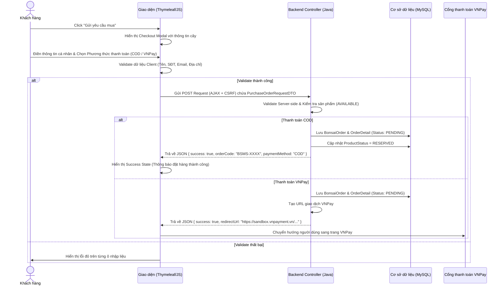

# HƯỚNG DẪN TRIỂN KHAI CHECKOUT MODAL (POP-UP ĐẶT MUA CÂY PHỔ THÔNG)
**Hệ thống Quản lý Cửa hàng Cây cảnh (BSMS - Bonsai Shop Management System)**

Tài liệu này được biên soạn bởi **Senior Front-end Developer & UI/UX Architect** nhằm cung cấp giải pháp thiết kế và phát triển tính năng **Checkout Modal** (Đặt mua cây phổ thông) đồng bộ với giao diện hiện tại của dự án BSMS, tuân thủ nghiệp vụ của UC-02 và định dạng truyền nhận dữ liệu của `PurchaseOrderRequestDTO`.

---

## 1. Phân Tích Nghiệp Vụ (Business Analysis)

### 1.1. Mục tiêu (UC-02: Đặt mua cây phổ thông)
Tính năng này hỗ trợ khách hàng đặt mua trực tiếp các sản phẩm bonsai phân khúc phổ thông mà **không bắt buộc phải đặt lịch hẹn xem cây trước (VIP)**. Người dùng có thể điền thông tin liên hệ và địa chỉ giao hàng ngay tại trang chi tiết sản phẩm và lựa chọn một trong hai phương thức thanh toán:
1. **COD (Giao hàng thu tiền tận nơi)**: Tạo đơn hàng thành công ở trạng thái `PENDING` (Chờ xử lý).
2. **Thanh toán trực tuyến VNPay**: Tạo đơn hàng ở trạng thái `PENDING` và chuyển hướng sang cổng VNPay để thanh toán ngay.

### 1.2. Luồng Nghiệp Vụ BF-01 (Purchase Order Flow)


### 1.3. Cấu trúc Data Transfer Object (`PurchaseOrderRequestDTO`)
Khi gửi request tạo đơn hàng lên API Backend, dữ liệu JSON cần khớp với cấu trúc sau:
```json
{
  "productId": 218,
  "customerName": "Nguyễn Văn A",
  "customerPhone": "0987654321",
  "customerEmail": "nguyenvana@gmail.com",
  "shippingAddress": "Số 12, ngõ 34, đường Lê Lợi, Nam Định",
  "paymentMethod": "COD" 
}
```
*(Lưu ý: Với sản phẩm Bonsai độc bản, số lượng `quantity` luôn mặc định bằng `1` và được quản lý logic ở phía Server).*

---

## 2. Cấu Trúc Kỹ Thuật (Technical Structure)

Để đảm bảo tính modular, dễ bảo trì và không làm ô nhiễm file `product-detail.html` hiện tại, ta tổ chức mã nguồn theo mô hình phân tách cấu trúc:

### 2.1. Đề xuất cấu trúc thư mục
```text
Bonsai_Shop/
├── src/
│   ├── main/
│   │   ├── java/com/example/bonsai_shop/
│   │   │   ├── product/
│   │   │   │   ├── dto/
│   │   │   │   │   └── PurchaseOrderRequestDTO.java  # [NEW] DTO nhận request từ Client
│   │   │   │   └── controller/
│   │   │   │       └── OrderApiController.java       # [NEW] REST API xử lý đặt đơn hàng
│   │   └── resources/
│   │       ├── templates/
│   │       │   ├── product/
│   │       │   │   └── product-detail.html           # [MODIFY] Tích hợp Fragment và Nút Mở Modal
│   │       │   └── fragments/
│   │       │       └── checkout-modal.html           # [NEW] Chứa mã nguồn HTML của Modal (Thymeleaf Fragment)
│   │       └── public/
│   │           ├── css/
│   │           │   └── checkout-modal.css            # [NEW] CSS riêng cho giao diện Modal
│   │           └── js/
│   │               └── checkout-modal.js             # [NEW] Xử lý sự kiện, Validate, AJAX Submit
```

### 2.2. Vai trò của từng file
1. `PurchaseOrderRequestDTO.java`: Khai báo các trường dữ liệu và ràng buộc validation phía Backend (`@NotBlank`, `@Email`, `@Pattern`).
2. `OrderApiController.java`: Xử lý HTTP POST gửi lên từ JS. Tạo đơn hàng trong Transaction, trả về JSON kết quả.
3. `checkout-modal.html`: Chứa cấu trúc HTML giao diện form nhập liệu, đóng gói dưới dạng Thymeleaf Fragment để tái sử dụng ở nhiều trang (như trang chủ hoặc giỏ hàng).
4. `checkout-modal.css`: CSS bổ trợ cho Bootstrap 5 để tạo nét thẩm mỹ cao cấp (màu sắc, hiệu ứng mờ kính backdrop-filter, hiệu ứng chuyển cảnh mượt mà).
5. `checkout-modal.js`: Trái tim điều khiển toàn bộ tương tác phía Client, đảm nhận nhiệm vụ kiểm soát Lifecycle của modal, bẫy tiêu điểm (Focus trapping), validate regex và gửi AJAX.

---

## 3. Hướng Dẫn Triển Khai Chi Tiết (Step-by-Step Implementation)

### Bước 3.1: Định nghĩa DDTO nhận dữ liệu từ Client (`PurchaseOrderRequestDTO.java`)
Tạo lớp DTO để hứng request JSON gửi lên từ Client. Sử dụng thư viện Validation để kiểm tra dữ liệu đầu vào tại Backend.

```java
package com.example.bonsai_shop.product.dto;

import jakarta.validation.constraints.Email;
import jakarta.validation.constraints.NotBlank;
import jakarta.validation.constraints.NotNull;
import jakarta.validation.constraints.Pattern;
import lombok.Data;

@Data
public class PurchaseOrderRequestDTO {

    @NotNull(message = "Mã sản phẩm không được trống")
    private Integer productId;

    @NotBlank(message = "Họ và tên khách hàng không được để trống")
    private String customerName;

    @NotBlank(message = "Số điện thoại không được để trống")
    @Pattern(regexp = "^(0|\\+84)(\\d{9})$", message = "Số điện thoại không hợp lệ (cần 10 chữ số)")
    private String customerPhone;

    @NotBlank(message = "Email không được để trống")
    @Email(message = "Địa chỉ email không đúng định dạng")
    private String customerEmail;

    @NotBlank(message = "Địa chỉ giao hàng không được để trống")
    private String shippingAddress;

    @NotBlank(message = "Phương thức thanh toán không được để trống")
    private String paymentMethod; // "COD" hoặc "VNPAY"
}
```

---

### Bước 3.2: Xây dựng HTML Structure (`checkout-modal.html`)
Sử dụng cấu trúc Bootstrap 5 Modal kết hợp các thuộc tính Accessibility (`role`, `aria-labelledby`, `aria-hidden`) để hỗ trợ trình đọc màn hình.

```html
<!-- src/main/resources/templates/fragments/checkout-modal.html -->
<div th:fragment="checkoutModal" 
     class="modal fade" 
     id="checkoutModal" 
     tabindex="-1" 
     aria-labelledby="checkoutModalLabel" 
     aria-hidden="true"
     data-bs-backdrop="static"
     data-bs-keyboard="false">
    
    <div class="modal-dialog modal-dialog-centered modal-lg">
        <div class="modal-content custom-modal-content">
            
            <!-- Modal Header -->
            <div class="modal-header border-0 pb-0">
                <h5 class="modal-title custom-modal-title" id="checkoutModalLabel">
                    <span class="gold-accent">🌿</span> Xác Nhận Đặt Mua Tác Phẩm
                </h5>
                <button type="button" class="btn-close btn-close-custom" data-bs-dismiss="modal" aria-label="Close" id="btnDismissModal"></button>
            </div>
            
            <!-- Modal Body (Form & Product Summary) -->
            <div class="modal-body pt-3">
                <div class="row g-4">
                    
                    <!-- Cột 1: Tóm tắt thông tin tác phẩm (Read-Only) -->
                    <div class="col-md-5 border-end-md">
                        <div class="product-preview-card">
                            <div class="preview-img-wrap">
                                
                            </div>
                            <div class="preview-info mt-3">
                                <span class="badge-premium mb-1" id="modalProductSegment">Premium</span>
                                <h4 class="product-preview-name mt-1" id="modalProductName">Tên tác phẩm</h4>
                                <p class="text-muted small mb-2" id="modalProductCode">Mã: BSMS-TLH-218</p>
                                <div class="price-panel-mini">
                                    <span class="price-label-mini">Giá trị tác phẩm</span>
                                    <h4 class="price-value-mini" id="modalProductPrice">0 đ</h4>
                                </div>
                            </div>
                        </div>
                    </div>
                    
                    <!-- Cột 2: Form nhập thông tin khách hàng -->
                    <div class="col-md-7">
                        <form id="checkoutForm" novalidate>
                            <!-- Hidden Fields -->
                            <input type="hidden" id="submitProductId" name="productId">
                            
                            <!-- Họ Tên -->
                            <div class="mb-3">
                                <label for="customerName" class="form-label required-label">Họ và tên người mua</label>
                                <div class="input-group">
                                    <span class="input-group-text"><i class="fa-regular fa-user"></i></span>
                                    <input type="text" class="form-control" id="customerName" name="customerName" required placeholder="Nguyễn Văn A">
                                    <div class="invalid-feedback" id="customerNameFeedback">Vui lòng nhập họ và tên của bạn.</div>
                                </div>
                            </div>
                            
                            <!-- Số Điện Thoại & Email (Flex Row) -->
                            <div class="row">
                                <div class="col-sm-6 mb-3">
                                    <label for="customerPhone" class="form-label required-label">Số điện thoại</label>
                                    <div class="input-group">
                                        <span class="input-group-text"><i class="fa-solid fa-phone"></i></span>
                                        <input type="tel" class="form-control" id="customerPhone" name="customerPhone" required placeholder="0987654321">
                                        <div class="invalid-feedback" id="customerPhoneFeedback">SĐT không hợp lệ (10 chữ số).</div>
                                    </div>
                                </div>
                                <div class="col-sm-6 mb-3">
                                    <label for="customerEmail" class="form-label required-label">Địa chỉ Email</label>
                                    <div class="input-group">
                                        <span class="input-group-text"><i class="fa-regular fa-envelope"></i></span>
                                        <input type="email" class="form-control" id="customerEmail" name="customerEmail" required placeholder="a@gmail.com">
                                        <div class="invalid-feedback" id="customerEmailFeedback">Email không hợp lệ.</div>
                                    </div>
                                </div>
                            </div>
                            
                            <!-- Địa chỉ giao hàng -->
                            <div class="mb-3">
                                <label for="shippingAddress" class="form-label required-label">Địa chỉ giao hàng</label>
                                <div class="input-group">
                                    <span class="input-group-text"><i class="fa-solid fa-map-location-dot"></i></span>
                                    <textarea class="form-control" id="shippingAddress" name="shippingAddress" rows="2" required placeholder="Số nhà, ngõ/đường, Phường/Xã, Quận/Huyện..."></textarea>
                                    <div class="invalid-feedback" id="shippingAddressFeedback">Vui lòng nhập địa chỉ nhận hàng.</div>
                                </div>
                            </div>
                            
                            <!-- Phương thức thanh toán -->
                            <div class="mb-4">
                                <label class="form-label required-label">Phương thức thanh toán</label>
                                <div class="d-flex gap-3">
                                    <!-- COD Option -->
                                    <div class="payment-method-card active" onclick="selectPaymentMethod('COD')">
                                        <input type="radio" name="paymentMethod" id="payCOD" value="COD" checked class="d-none">
                                        <div class="pm-icon"><i class="fa-solid fa-truck-ramp-box"></i></div>
                                        <div class="pm-text">
                                            <div class="pm-title">COD</div>
                                            <div class="pm-desc">Thanh toán khi nhận cây</div>
                                        </div>
                                        <div class="pm-badge"><i class="fa-solid fa-circle-check"></i></div>
                                    </div>
                                    
                                    <!-- VNPay Option -->
                                    <div class="payment-method-card" onclick="selectPaymentMethod('VNPAY')">
                                        <input type="radio" name="paymentMethod" id="payVNPAY" value="VNPAY" class="d-none">
                                        <div class="pm-icon text-primary"><i class="fa-solid fa-credit-card"></i></div>
                                        <div class="pm-text">
                                            <div class="pm-title">VNPay</div>
                                            <div class="pm-desc">Cổng thanh toán điện tử</div>
                                        </div>
                                        <div class="pm-badge"><i class="fa-solid fa-circle-check"></i></div>
                                    </div>
                                </div>
                            </div>
                        </form>
                    </div>
                </div>
            </div>
            
            <!-- Modal Footer -->
            <div class="modal-footer border-0 pt-0">
                <button type="button" class="btn btn-secondary-custom" data-bs-dismiss="modal">Hủy bỏ</button>
                <button type="button" class="btn btn-primary-custom" id="btnSubmitOrder" onclick="processOrderSubmit()">
                    <span class="normal-state">Xác Nhận Đặt Mua <i class="fa-solid fa-arrow-right ms-1"></i></span>
                    <span class="loading-state d-none">
                        <span class="spinner-border spinner-border-sm me-2" role="status" aria-hidden="true"></span>
                        Đang tạo đơn hàng...
                    </span>
                </button>
            </div>
            
            <!-- Dynamic States overlays (Success/Error states) -->
            <div id="modalSuccessOverlay" class="state-overlay d-none">
                <div class="state-content text-center">
                    <div class="success-icon-animation">
                        <i class="fa-solid fa-circle-check"></i>
                    </div>
                    <h3 class="state-title mt-3">Đặt Hàng Thành Công!</h3>
                    <p class="state-desc mt-2">Đơn hàng <strong id="successOrderCode" class="text-gold"></strong> của bạn đã được ghi nhận vào hệ thống BSMS.</p>
                    <p class="text-muted small">Nhân viên hỗ trợ sẽ liên hệ với bạn qua SĐT trong 15 phút tới để xác minh thủ tục giao nhận cây cẩu chuyên dụng.</p>
                    <button type="button" class="btn btn-primary-custom mt-4" data-bs-dismiss="modal" onclick="location.reload()">Đóng & Làm Mới Trang</button>
                </div>
            </div>

            <div id="modalErrorOverlay" class="state-overlay d-none">
                <div class="state-content text-center">
                    <div class="error-icon-animation">
                        <i class="fa-solid fa-circle-xmark"></i>
                    </div>
                    <h3 class="state-title mt-3">Đã Xảy Ra Lỗi</h3>
                    <p class="state-desc mt-2" id="errorOverlayMessage">Không thể kết nối đến máy chủ. Vui lòng thử lại.</p>
                    <div class="d-flex justify-content-center gap-3 mt-4">
                        <button type="button" class="btn btn-secondary-custom" onclick="hideErrorOverlay()">Quay lại Form</button>
                        <button type="button" class="btn btn-primary-custom" onclick="processOrderSubmit()">Thử lại</button>
                    </div>
                </div>
            </div>
            
        </div>
    </div>
</div>
```

---

### Bước 3.3: Thiết kế CSS Mỹ Thuật Cao Cấp (`checkout-modal.css`)
CSS tùy biến sử dụng các biến CSS hiện tại để đảm bảo Modal hòa quyện với phong cách "Làng vườn cổ nghệ thuật" (Garamond cổ điển, Jakarta tinh tế, điểm nhấn Vàng/Đồng cổ).

```css
/* src/main/resources/public/css/checkout-modal.css */

/* Custom Variables kế thừa bảng màu chi tiết của BSMS */
:root {
    --bsms-green: #1E3F20;
    --bsms-green-hover: #142a15;
    --bsms-gold: #C5A880;
    --bsms-gold-dark: #b59567;
    --bsms-dark: #111111;
    --bsms-bg-soft: #FAF9F6;
    --glass-blur: blur(8px);
}

/* Hiệu ứng làm mờ màn hình nền phía sau (Backdrop Filter) */
.modal-backdrop.show {
    opacity: 0.6;
    backdrop-filter: var(--glass-blur);
    -webkit-backdrop-filter: var(--glass-blur);
    background-color: rgba(17, 17, 17, 0.8) !important;
}

/* Modal Content dạng khung tranh cổ điển */
.custom-modal-content {
    background-color: var(--bsms-bg-soft);
    border: 1px solid rgba(197, 168, 128, 0.3);
    border-radius: 12px;
    box-shadow: 0 10px 40px rgba(0, 0, 0, 0.35);
    overflow: hidden;
    position: relative;
    font-family: 'Plus Jakarta Sans', sans-serif;
}

.custom-modal-title {
    font-family: 'Cormorant Garamond', serif;
    font-weight: 700;
    font-size: 1.6rem;
    color: var(--bsms-green);
}

.gold-accent {
    color: var(--bsms-gold);
}

/* Preview của cây cảnh bên trái modal */
.product-preview-card {
    background: #ffffff;
    border: 1px solid rgba(0,0,0,0.06);
    border-radius: 8px;
    padding: 16px;
    height: 100%;
}

.preview-img-wrap {
    overflow: hidden;
    border-radius: 6px;
    aspect-ratio: 4/3;
}

.preview-img-wrap img {
    width: 100%;
    height: 100%;
    object-fit: cover;
    transition: transform 0.5s ease;
}

.product-preview-card:hover .preview-img-wrap img {
    transform: scale(1.05);
}

.price-panel-mini {
    background: rgba(197, 168, 128, 0.08);
    border-left: 3px solid var(--bsms-gold);
    padding: 10px 14px;
    border-radius: 0 6px 6px 0;
}

.price-label-mini {
    font-size: 0.75rem;
    color: #666666;
    display: block;
    text-transform: uppercase;
    letter-spacing: 0.5px;
}

.price-value-mini {
    font-family: 'Cormorant Garamond', serif;
    color: var(--bsms-green);
    font-weight: 700;
    margin: 0;
}

/* Custom form labels */
.required-label::after {
    content: " *";
    color: #dc3545;
    font-weight: bold;
}

.form-label {
    font-weight: 600;
    font-size: 0.85rem;
    color: #444444;
    margin-bottom: 6px;
}

.input-group-text {
    background-color: #ffffff;
    border-color: rgba(0, 0, 0, 0.12);
    color: #666666;
}

.form-control, .form-select {
    border-color: rgba(0, 0, 0, 0.12);
    font-size: 0.9rem;
    padding: 10px 12px;
}

.form-control:focus, .form-select:focus {
    border-color: var(--bsms-gold);
    box-shadow: 0 0 0 3px rgba(197, 168, 128, 0.2);
}

/* Cột chọn phương thức thanh toán kiểu Card */
.payment-method-card {
    flex: 1;
    border: 2px solid rgba(0, 0, 0, 0.08);
    border-radius: 8px;
    padding: 14px;
    cursor: pointer;
    position: relative;
    display: flex;
    align-items: center;
    gap: 12px;
    background: #ffffff;
    transition: all 0.25s ease;
}

.payment-method-card:hover {
    border-color: rgba(197, 168, 128, 0.5);
    background: rgba(197, 168, 128, 0.02);
}

.payment-method-card.active {
    border-color: var(--bsms-green);
    background: rgba(30, 63, 32, 0.02);
}

.pm-icon {
    font-size: 1.5rem;
    color: #555555;
}

.pm-title {
    font-weight: 700;
    font-size: 0.95rem;
    color: var(--bsms-dark);
}

.pm-desc {
    font-size: 0.72rem;
    color: #777777;
}

.pm-badge {
    position: absolute;
    top: -8px;
    right: -8px;
    font-size: 1.1rem;
    color: var(--bsms-green);
    background: #ffffff;
    border-radius: 50%;
    display: none;
}

.payment-method-card.active .pm-badge {
    display: block;
}

/* Buttons */
.btn-primary-custom {
    background-color: var(--bsms-green);
    border-color: var(--bsms-green);
    color: #ffffff;
    padding: 10px 24px;
    font-weight: 600;
    border-radius: 6px;
    transition: all 0.2s ease;
}

.btn-primary-custom:hover, .btn-primary-custom:focus {
    background-color: var(--bsms-green-hover);
    border-color: var(--bsms-green-hover);
    color: #ffffff;
}

.btn-secondary-custom {
    background-color: transparent;
    border: 1px solid rgba(0, 0, 0, 0.2);
    color: #444444;
    padding: 10px 20px;
    font-weight: 600;
    border-radius: 6px;
}

.btn-secondary-custom:hover {
    background-color: rgba(0, 0, 0, 0.05);
    color: var(--bsms-dark);
}

/* Overlay hiển thị trạng thái động (Success/Error) */
.state-overlay {
    position: absolute;
    top: 0;
    left: 0;
    width: 100%;
    height: 100%;
    background-color: rgba(250, 249, 246, 0.98);
    display: flex;
    align-items: center;
    justify-content: center;
    z-index: 1060;
    animation: fadeInOverlay 0.3s cubic-bezier(0.16, 1, 0.3, 1) forwards;
}

@keyframes fadeInOverlay {
    from { opacity: 0; transform: scale(1.02); }
    to { opacity: 1; transform: scale(1); }
}

.state-content {
    max-width: 500px;
    padding: 30px;
}

.success-icon-animation {
    font-size: 4.5rem;
    color: #28a745;
    animation: bounceIn 0.5s cubic-bezier(0.175, 0.885, 0.32, 1.275);
}

.error-icon-animation {
    font-size: 4.5rem;
    color: #dc3545;
    animation: bounceIn 0.5s cubic-bezier(0.175, 0.885, 0.32, 1.275);
}

@keyframes bounceIn {
    0% { transform: scale(0.3); opacity: 0; }
    50% { transform: scale(1.1); }
    70% { transform: scale(0.9); }
    100% { transform: scale(1); opacity: 1; }
}

.text-gold {
    color: var(--bsms-gold-dark) !important;
}

/* Utilities */
@media (min-width: 768px) {
    .border-end-md {
        border-end: 1px solid rgba(0,0,0,0.08);
    }
}
```

---

### Bước 3.4: Xử lý Logic JavaScript (`checkout-modal.js`)
File điều phối chứa logic mở popup, thiết lập thông tin động, validate input theo thời gian thực (Regex) và gọi AJAX an toàn.

```javascript
/* src/main/resources/public/js/checkout-modal.js */

document.addEventListener('DOMContentLoaded', () => {
    initRealtimeValidation();
});

// Đối tượng lưu trạng thái focus hiện tại phục vụ cho Focus Trapping
let lastFocusedElement = null;

/**
 * Hàm kích hoạt hiển thị Modal và gán động dữ liệu cây cảnh
 * Được gọi từ nút "Gửi yêu cầu mua" ở trang chi tiết sản phẩm
 */
function openCheckoutModal(productId, productName, productCode, priceStr, imgUrl, segmentName) {
    // Lưu lại phần tử cuối cùng được chọn trước khi mở modal
    lastFocusedElement = document.activeElement;
    
    // Gán dữ liệu sang các trường thông tin trong Modal
    document.getElementById('submitProductId').value = productId;
    document.getElementById('modalProductName').innerText = productName;
    document.getElementById('modalProductCode').innerText = `Mã: ${productCode}`;
    document.getElementById('modalProductPrice').innerText = priceStr;
    document.getElementById('modalProductImg').src = imgUrl || 'https://images.unsplash.com/photo-1599599810769-bcde5a160d32?auto=format&fit=crop&q=80&w=800';
    
    const segmentEl = document.getElementById('modalProductSegment');
    segmentEl.innerText = segmentName || 'Popular';
    if(segmentName === 'Premium' || segmentName === 'VIP') {
        segmentEl.className = 'badge-premium mb-1';
    } else {
        segmentEl.className = 'badge-status-pill avail mb-1';
    }
    
    // Reset Form về trạng thái sạch sẽ ban đầu
    resetCheckoutForm();
    
    // Hiển thị Modal thông qua Bootstrap API
    const modalElement = document.getElementById('checkoutModal');
    const modalInstance = new bootstrap.Modal(modalElement);
    modalInstance.show();
    
    // Bẫy phím Tab bên trong modal (Accessibility)
    setupFocusTrap(modalElement);
}

/**
 * Đặt lại trạng thái ban đầu cho Form và ẩn các overlay thông báo
 */
function resetCheckoutForm() {
    const form = document.getElementById('checkoutForm');
    form.reset();
    form.classList.remove('was-validated');
    
    // Loại bỏ class lỗi thủ công trên từng ô input
    const inputs = form.querySelectorAll('.form-control');
    inputs.forEach(input => {
        input.classList.remove('is-invalid', 'is-valid');
    });
    
    // Đảm bảo phương thức COD được chọn mặc định
    selectPaymentMethod('COD');
    
    // Ẩn các Overlay thông báo thành công / lỗi
    document.getElementById('modalSuccessOverlay').classList.add('d-none');
    document.getElementById('modalErrorOverlay').classList.add('d-none');
    
    // Khôi phục trạng thái nút submit
    enableSubmitButton();
}

/**
 * Chuyển đổi trạng thái hiển thị của các thẻ Phương thức thanh toán
 */
function selectPaymentMethod(method) {
    const cards = document.querySelectorAll('.payment-method-card');
    cards.forEach(card => card.classList.remove('active'));
    
    if (method === 'COD') {
        document.getElementById('payCOD').checked = true;
        document.querySelector('[onclick="selectPaymentMethod(\'COD\')"]').classList.add('active');
    } else {
        document.getElementById('payVNPAY').checked = true;
        document.querySelector('[onclick="selectPaymentMethod(\'VNPAY\')"]').classList.add('active');
    }
}

/**
 * Validate phía Client theo thời gian thực (realtime) khi người dùng gõ phím
 */
function initRealtimeValidation() {
    const rules = {
        customerName: (val) => val.trim().length >= 2,
        customerPhone: (val) => /^(0|\+84)(\d{9})$/.test(val.trim()),
        customerEmail: (val) => /^[^\s@]+@[^\s@]+\.[^\s@]+$/.test(val.trim()),
        shippingAddress: (val) => val.trim().length >= 10
    };
    
    Object.keys(rules).forEach(fieldId => {
        const input = document.getElementById(fieldId);
        if (!input) return;
        
        const validateField = () => {
            const isValid = rules[fieldId](input.value);
            if (isValid) {
                input.classList.remove('is-invalid');
                input.classList.add('is-valid');
            } else {
                input.classList.remove('is-valid');
                input.classList.add('is-invalid');
            }
            return isValid;
        };
        
        input.addEventListener('input', validateField);
        input.addEventListener('blur', validateField);
    });
}

/**
 * Kiểm tra toàn bộ form trước khi gửi submit
 */
function validateWholeForm() {
    const rules = {
        customerName: (val) => val.trim().length >= 2,
        customerPhone: (val) => /^(0|\+84)(\d{9})$/.test(val.trim()),
        customerEmail: (val) => /^[^\s@]+@[^\s@]+\.[^\s@]+$/.test(val.trim()),
        shippingAddress: (val) => val.trim().length >= 10
    };
    
    let isAllValid = true;
    
    Object.keys(rules).forEach(fieldId => {
        const input = document.getElementById(fieldId);
        const isValid = rules[fieldId](input.value);
        if (!isValid) {
            input.classList.add('is-invalid');
            isAllValid = false;
        } else {
            input.classList.remove('is-invalid');
            input.classList.add('is-valid');
        }
    });
    
    return isAllValid;
}

/**
 * Vô hiệu hóa nút Submit và hiển thị Spinner (Chặn double-submit)
 */
function disableSubmitButton() {
    const btn = document.getElementById('btnSubmitOrder');
    btn.disabled = true;
    btn.querySelector('.normal-state').classList.add('d-none');
    btn.querySelector('.loading-state').classList.remove('d-none');
}

/**
 * Kích hoạt lại nút Submit
 */
function enableSubmitButton() {
    const btn = document.getElementById('btnSubmitOrder');
    btn.disabled = false;
    btn.querySelector('.normal-state').classList.remove('d-none');
    btn.querySelector('.loading-state').classList.add('d-none');
}

/**
 * Xử lý sự kiện gửi đơn hàng (AJAX Request)
 */
function processOrderSubmit() {
    if (!validateWholeForm()) {
        return; // Dừng xử lý nếu có lỗi validate phía client
    }
    
    disableSubmitButton();
    
    // Thu thập dữ liệu form để đóng gói DTO
    const productId = parseInt(document.getElementById('submitProductId').value, 10);
    const customerName = document.getElementById('customerName').value.trim();
    const customerPhone = document.getElementById('customerPhone').value.trim();
    const customerEmail = document.getElementById('customerEmail').value.trim();
    const shippingAddress = document.getElementById('shippingAddress').value.trim();
    const paymentMethod = document.querySelector('input[name="paymentMethod"]:checked').value;
    
    const requestData = {
        productId,
        customerName,
        customerPhone,
        customerEmail,
        shippingAddress,
        paymentMethod
    };
    
    // Lấy CSRF tokens từ Meta tags đã được nhúng sẵn trên trang product-detail
    const csrfToken = document.querySelector('meta[name="_csrf"]')?.getAttribute('content');
    const csrfHeader = document.querySelector('meta[name="_csrf_header"]')?.getAttribute('content');
    
    const headers = {
        'Content-Type': 'application/json'
    };
    if (csrfToken && csrfHeader) {
        headers[csrfHeader] = csrfToken; // Gửi kèm token để vượt qua bộ lọc Spring Security
    }
    
    // Gửi yêu cầu AJAX lên Backend
    fetch('/api/orders/checkout', {
        method: 'POST',
        headers: headers,
        body: JSON.stringify(requestData)
    })
    .then(async response => {
        const data = await response.json();
        if (response.ok && data.success) {
            handleOrderSuccess(data);
        } else {
            handleOrderError(data.message || 'Lỗi xử lý đơn hàng từ hệ thống.');
        }
    })
    .catch(error => {
        console.error('AJAX Error:', error);
        handleOrderError('Không thể kết nối đến máy chủ. Vui lòng kiểm tra lại mạng internet của bạn.');
    });
}

/**
 * Xử lý khi Backend phản hồi thành công
 */
function handleOrderSuccess(data) {
    if (data.paymentMethod === 'VNPAY' && data.redirectUrl) {
        // Chuyển hướng ngay lập tức sang VNPay sandbox để tiếp tục thanh toán
        window.location.href = data.redirectUrl;
    } else {
        // Hiển thị Overlay thành công đối với giao dịch COD
        document.getElementById('successOrderCode').innerText = data.orderCode;
        document.getElementById('modalSuccessOverlay').classList.remove('d-none');
    }
}

/**
 * Xử lý khi Backend phản hồi thất bại hoặc mất kết nối mạng
 */
function handleOrderError(errorMessage) {
    enableSubmitButton();
    document.getElementById('errorOverlayMessage').innerText = errorMessage;
    document.getElementById('modalErrorOverlay').classList.remove('d-none');
}

function hideErrorOverlay() {
    document.getElementById('modalErrorOverlay').classList.add('d-none');
}

/**
 * Thiết lập Focus Trapping đảm bảo bàn phím không thoát khỏi Modal khi đang mở (Accessibility)
 */
function setupFocusTrap(modalEl) {
    const focusableElements = modalEl.querySelectorAll('a[href], area[href], input:not([disabled]), select:not([disabled]), textarea:not([disabled]), button:not([disabled]), iframe, object, embed, [tabindex="0"], [contenteditable]');
    const firstFocusableEl = focusableElements[0];
    const lastFocusableEl = focusableElements[focusableElements.length - 1];
    
    modalEl.addEventListener('keydown', function(e) {
        const isTabPressed = (e.key === 'Tab' || e.keyCode === 9);
        if (!isTabPressed) return;
        
        if (e.shiftKey) { /* Shift + Tab: Di chuyển ngược chiều */
            if (document.activeElement === firstFocusableEl) {
                lastFocusableEl.focus();
                e.preventDefault();
            }
        } else { /* Tab: Di chuyển xuôi chiều */
            if (document.activeElement === lastFocusableEl) {
                firstFocusableEl.focus();
                e.preventDefault();
            }
        }
    });
    
    // Tự động focus vào ô đầu tiên sau khi modal mở hoàn tất
    modalEl.addEventListener('shown.bs.modal', () => {
        document.getElementById('customerName').focus();
    });
    
    // Khôi phục tiêu điểm của phần tử bấm trước khi mở modal khi đóng modal
    modalEl.addEventListener('hidden.bs.modal', () => {
        if (lastFocusedElement) {
            lastFocusedElement.focus();
        }
    });
}
```

---

### Bước 3.5: Phát triển REST Controller xử lý API đầu cuối (`OrderApiController.java`)
Tạo REST Controller tại Backend nhận request JSON, thực hiện xác thực nghiệp vụ, và lưu trữ dữ liệu vào database.

```java
package com.example.bonsai_shop.product.controller;

import com.example.bonsai_shop.config.VNPayConfig;
import com.example.bonsai_shop.entity.BonsaiOrder;
import com.example.bonsai_shop.entity.OrderDetail;
import com.example.bonsai_shop.entity.Product;
import com.example.bonsai_shop.entity.User;
import com.example.bonsai_shop.product.dto.PurchaseOrderRequestDTO;
import com.example.bonsai_shop.product.repository.ProductRepository;
import com.example.bonsai_shop.customer.repository.UserRepository;
import jakarta.servlet.http.HttpServletRequest;
import jakarta.validation.Valid;
import org.springframework.beans.factory.annotation.Autowired;
import org.springframework.http.ResponseEntity;
import org.springframework.security.core.annotation.AuthenticationPrincipal;
import org.springframework.security.core.userdetails.UserDetails;
import org.springframework.transaction.annotation.Transactional;
import org.springframework.web.bind.annotation.*;

import java.io.UnsupportedEncodingException;
import java.math.BigDecimal;
import java.net.URLEncoder;
import java.nio.charset.StandardCharsets;
import java.text.SimpleDateFormat;
import java.time.LocalDateTime;
import java.util.*;

@RestController
@RequestMapping("/api/orders")
public class OrderApiController {

    @Autowired
    private ProductRepository productRepository;

    @Autowired
    private UserRepository userRepository;

    @PostMapping("/checkout")
    @Transactional
    public ResponseEntity<Map<String, Object>> checkout(
            @Valid @RequestBody PurchaseOrderRequestDTO dto,
            @AuthenticationPrincipal UserDetails currentUser,
            HttpServletRequest request) throws UnsupportedEncodingException {

        Map<String, Object> response = new HashMap<>();

        // 1. Kiểm tra sản phẩm
        Product product = productRepository.findById(dto.getProductId())
                .orElse(null);
        if (product == null) {
            response.put("success", false);
            response.put("message", "Sản phẩm cây cảnh này không tồn tại!");
            return ResponseEntity.badRequest().body(response);
        }

        // Đảm bảo cây đang ở trạng thái AVAILABLE
        if (!"AVAILABLE".equals(product.getProductStatus())) {
            response.put("success", false);
            response.put("message", "Tác phẩm này đã được bán hoặc đã có khách đặt trước!");
            return ResponseEntity.badRequest().body(response);
        }

        // 2. Lấy thông tin user hiện tại (nếu đã đăng nhập)
        User customer = null;
        if (currentUser != null) {
            customer = userRepository.findByEmail(currentUser.getUsername()).orElse(null);
        }

        // 3. Khởi tạo BonsaiOrder
        String orderCode = "BSMS-" + VNPayConfig.getRandomNumber(6).toUpperCase();
        BonsaiOrder order = BonsaiOrder.builder()
                .customer(customer)
                .orderCode(orderCode)
                .customerName(dto.getCustomerName())
                .customerPhone(dto.getCustomerPhone())
                .customerEmail(dto.getCustomerEmail())
                .shippingAddress(dto.getShippingAddress())
                .orderDate(LocalDateTime.now())
                .totalAmount(product.getPrice())
                .depositAmount(BigDecimal.ZERO)
                .orderStatus("PENDING")
                .build();

        // 4. Thiết lập chi tiết đơn hàng (OrderDetail)
        OrderDetail detail = OrderDetail.builder()
                .order(order)
                .product(product)
                .priceAtPurchase(product.getPrice())
                .build();
        order.setOrderDetails(Collections.singletonList(detail));

        // 5. Cập nhật trạng thái sản phẩm thành RESERVED để tránh người khác đặt mua trùng
        product.setProductStatus("RESERVED");
        productRepository.save(product);

        // Giả sử có OrderRepository để lưu đơn hàng
        // orderRepository.save(order);

        // 6. Xử lý phân nhánh Phương thức thanh toán
        if ("VNPAY".equalsIgnoreCase(dto.getPaymentMethod())) {
            // Logic tạo URL thanh toán VNPay
            String paymentUrl = buildVNPayUrl(request, orderCode, product.getPrice());
            response.put("success", true);
            response.put("paymentMethod", "VNPAY");
            response.put("redirectUrl", paymentUrl);
        } else {
            // Thanh toán COD thành công
            response.put("success", true);
            response.put("paymentMethod", "COD");
            response.put("orderCode", orderCode);
        }

        return ResponseEntity.ok(response);
    }

    private String buildVNPayUrl(HttpServletRequest req, String orderCode, BigDecimal amount) 
            throws UnsupportedEncodingException {
        long amountLong = amount.longValue() * 100;
        String vnp_Version = "2.1.0";
        String vnp_Command = "pay";
        String vnp_IpAddr = VNPayConfig.getIpAddress(req);
        
        Map<String, String> vnp_Params = new HashMap<>();
        vnp_Params.put("vnp_Version", vnp_Version);
        vnp_Params.put("vnp_Command", vnp_Command);
        vnp_Params.put("vnp_TmnCode", VNPayConfig.vnp_TmnCode);
        vnp_Params.put("vnp_Amount", String.valueOf(amountLong));
        vnp_Params.put("vnp_CurrCode", "VND");
        vnp_Params.put("vnp_TxnRef", orderCode);
        vnp_Params.put("vnp_OrderInfo", "Thanh toan don hang BSMS:" + orderCode);
        vnp_Params.put("vnp_OrderType", "other");
        vnp_Params.put("vnp_Locale", "vn");
        vnp_Params.put("vnp_ReturnUrl", VNPayConfig.vnp_ReturnUrl);
        vnp_Params.put("vnp_IpAddr", vnp_IpAddr);

        Calendar cld = Calendar.getInstance(TimeZone.getTimeZone("Etc/GMT+7"));
        SimpleDateFormat formatter = new SimpleDateFormat("yyyyMMddHHmmss");
        vnp_Params.put("vnp_CreateDate", formatter.format(cld.getTime()));
        
        cld.add(Calendar.MINUTE, 15);
        vnp_Params.put("vnp_ExpireDate", formatter.format(cld.getTime()));

        List<String> fieldNames = new ArrayList<>(vnp_Params.keySet());
        Collections.sort(fieldNames);
        StringBuilder hashData = new StringBuilder();
        StringBuilder query = new StringBuilder();
        
        for (int i = 0; i < fieldNames.size(); i++) {
            String fieldName = fieldNames.get(i);
            String fieldValue = vnp_Params.get(fieldName);
            if ((fieldValue != null) && (fieldValue.length() > 0)) {
                hashData.append(fieldName).append('=').append(URLEncoder.encode(fieldValue, StandardCharsets.US_ASCII.toString()).replace("+", "%20"));
                query.append(URLEncoder.encode(fieldName, StandardCharsets.US_ASCII.toString())).append('=').append(URLEncoder.encode(fieldValue, StandardCharsets.US_ASCII.toString()));
                if (i < fieldNames.size() - 1) {
                    query.append('&');
                    hashData.append('&');
                }
            }
        }
        
        String queryUrl = query.toString();
        String vnp_SecureHash = VNPayConfig.hmacSHA512(VNPayConfig.vnp_HashSecret, hashData.toString());
        queryUrl += "&vnp_SecureHash=" + vnp_SecureHash;

        return VNPayConfig.vnp_PayUrl + "?" + queryUrl;
    }
}
```

---

### Bước 3.6: Tích hợp vào Trang Chi Tiết Sản Phẩm (`product-detail.html`)
Mở file chi tiết sản phẩm và thêm mã nhúng liên kết, nhúng fragment và cập nhật sự kiện nút bấm.

1. **Nhúng thẻ `<meta>` chứa CSRF Token** vào phần `<head>` của trang:
```html
<meta name="_csrf" th:content="${_csrf.token}"/>
<meta name="_csrf_header" th:content="${_csrf.headerName}"/>
```

2. **Liên kết File CSS và JS** của Modal:
```html
<!-- Chèn CSS vào cuối head tag -->
<link rel="stylesheet" th:href="@{/css/checkout-modal.css}">

<!-- Chèn JS vào cuối body tag (sau Bootstrap Bundle) -->
<script th:src="@{/js/checkout-modal.js}"></script>
```

3. **Cập nhật nút hành động "Gửi yêu cầu mua"** trên trang `product-detail.html`:
```html
<!-- Thay thế form action cũ (submit trực tiếp VNPay) bằng cấu trúc nút bấm an toàn -->
<button type="button" 
        class="btn-buy-vnpay" 
        th:if="${product.productStatus == 'AVAILABLE'}"
        th:data-id="${product.productId}"
        th:data-name="${product.productName}"
        th:data-code="${product.productCode}"
        th:data-price="${#numbers.formatDecimal(product.price, 0, 'POINT', 0, 'POINT') + ' đ'}"
        th:data-img="${product.firstImageUrl}"
        th:data-segment="${product.segment != null ? product.segment.segmentName : 'Popular'}"
        onclick="openCheckoutModal(
            this.getAttribute('data-id'), 
            this.getAttribute('data-name'), 
            this.getAttribute('data-code'), 
            this.getAttribute('data-price'), 
            this.getAttribute('data-img'), 
            this.getAttribute('data-segment')
        )">
    Gửi yêu cầu mua
</button>
```

4. **Nhúng Fragment Modal** ở cuối phần `<body>` của file:
```html
<!-- Đặt ngay trước thẻ đóng </body> -->
<div th:replace="~{fragments/checkout-modal :: checkoutModal}"></div>
```

---

## 4. UI/UX Guidelines & Accessibility (Đại Cương Thiết Kế)

### 4.1. Visual States (Quản lý các trạng thái giao diện)
*   **Trạng thái mặc định (Default State)**: Form hiển thị gọn gàng, các nút bấm nổi bật, placeholder trực quan chỉ dẫn cách nhập dữ liệu.
*   **Trạng thái nhập sai (Invalid State)**: Tận dụng thuộc tính `.is-invalid` của Bootstrap kết hợp viền màu đỏ đậm `#dc3545`. Thông báo lỗi trực quan đặt ngay dưới trường nhập liệu với kích thước chữ nhỏ và sắc nét, chỉ rõ quy chuẩn đúng (Ví dụ: "Số điện thoại bắt đầu từ 0 và có 10 chữ số").
*   **Trạng thái tải (Loading State)**: Khi bấm nút gửi đơn hàng:
    *   Vô hiệu hóa (`disabled`) tất cả trường nhập liệu và nút đóng modal để chặn tương tác gián đoạn.
    *   Nút submit chuyển đổi hiển thị Spinner xoay tròn và nhãn "Đang tạo đơn hàng...".
*   **Trạng thái thành công (Success State)**: Overlay xanh dịu che phủ toàn bộ form. Một biểu tượng Checkmark xanh lục (`#28a745`) chuyển động bật nhảy (CSS Bounce) để kích thích thụ thể Dopamine của khách hàng, tạo trải nghiệm mua sắm tích cực.
*   **Trạng thái lỗi (Error State)**: Overlay màu đỏ mờ hiển thị thông báo lỗi phản hồi từ Server. Trạng thái này lưu giữ toàn bộ thông tin khách hàng đã nhập để người dùng không phải điền lại sau khi bấm nút "Quay lại Form".

### 4.2. Responsive Grid & Layout
*   Sử dụng lưới Bootstrap `.row` và các breakpoint `.col-md-5` kết hợp `.col-md-7` để hiển thị 2 cột trên màn hình Desktop (Bên trái: Thông tin sản phẩm dạng ảnh thẻ, bên phải: Form nhập dữ liệu).
*   Trên màn hình điện thoại dưới `768px`, bố cục tự động chuyển dọc (Single column), cột tóm tắt cây nằm lên trên form để người dùng luôn định vị được sản phẩm mình đang chi trả.
*   Tất cả ô nhập liệu sử dụng thẻ `.input-group` có đính kèm icon giúp tăng diện tích tương tác xúc giác trên điện thoại.

### 4.3. Accessibility (Rào cản khả năng tiếp cận)
*   **Focus Trapping (Bẫy tiêu điểm)**: Khi modal mở rộng, tiêu điểm bàn phím tự động chuyển dịch đến phần tử nhập liệu đầu tiên (`#customerName`). Nhấn phím `Tab` hay `Shift+Tab` sẽ xoay vòng tiêu điểm nội bộ trong modal mà không thể thất thoát ra các thành phần ẩn ở nền trang chi tiết sản phẩm.
*   **Bàn phím thân thiện (Aria-hidden)**: Cấu hình `aria-hidden="true"` cho modal khi đóng lại để công cụ đọc màn hình (Screen Reader) tự động bỏ qua, tránh gây nhiễu cho người dùng khiếm thị.
*   **Scroll Lock (Khóa cuộn trang nền)**: Khi mở modal, tự động thêm class `.modal-open` của Bootstrap lên thẻ `<body>` để ngăn chặn hiệu ứng trượt cuộn kép trang đằng sau gây mất định hướng không gian.

---

## 5. Checklist Kiểm Thử (Testing Checklist)

Trước khi nghiệm thu bàn giao tính năng, Senior Front-end Developer cần tự kiểm thử và đánh dấu xác nhận các hạng mục kỹ thuật dưới đây:

*   [ ] **Đóng modal bằng phím ESC**: Khi đang điền form, nhấn nút `Escape` trên bàn phím có kích hoạt đóng modal và tự động xóa sạch dữ liệu form cũ hay không?
*   [ ] **Đóng bằng click vùng ngoài (Overlay Click)**: Theo nghiệp vụ thanh toán, modal cấu hình `data-bs-backdrop="static"` nên khi click vùng xám ngoài modal form phải giữ nguyên trạng thái (Không tự đóng mất dữ liệu đang gõ).
*   [ ] **Ngăn chặn Double-Submission**: Thao tác nhấp chuột liên tục 2 lần vào nút "Xác Nhận Đặt Mua" phải bị chặn lại bằng cơ chế vô hiệu hóa thuộc tính `disabled` lập tức.
*   [ ] **Validate Regex phía Client**:
    *   [ ] Nhập SĐT ít hơn 10 chữ số hoặc chứa chữ cái -> Báo lỗi viền đỏ.
    *   [ ] Nhập Email thiếu ký tự `@` hoặc sai tên miền -> Báo lỗi viền đỏ.
    *   [ ] Nhập địa chỉ dưới 10 ký tự (Ví dụ nhập mỗi "Hà Nội") -> Yêu cầu nhập chi tiết để ship hàng.
*   [ ] **CSRF Verification**: Thực hiện gửi thử đơn hàng trên môi trường bật Spring Security để đảm bảo không bị chặn lỗi HTTP 403 Forbidden do thiếu CSRF Token.
*   [ ] **Khôi phục tiêu điểm (Focus Recovery)**: Sau khi đóng modal bằng nút "Hủy bỏ", tiêu điểm có tự động trả về vị trí nút "Gửi yêu cầu mua" trên trang chi tiết sản phẩm ban đầu để bảo vệ trải nghiệm của người dùng dùng bàn phím không?

---

## 6. Lỗi Phổ Biến Cần Tránh (Common Pitfalls)

1.  **Lỗi Double Submission (Bấm đúp tạo đơn trùng)**: Do kết nối mạng 3G/4G chập chờn, khách hàng có thói quen bấm nhiều lần vào nút Đặt mua khi thấy trang chưa phản hồi. Nếu không chặn bằng cách khóa nút bấm, hệ thống sẽ tạo ra nhiều bản ghi đơn hàng trùng nhau trong Database.
2.  **Lỗi Stale State (Dữ liệu cũ tồn đọng)**: Khi bấm xem cây A, mở modal điền thông tin nửa chừng rồi tắt đi, sau đó bấm xem cây B và mở lại modal -> Nếu không gọi hàm reset form sạch sẽ, thông tin sản phẩm và dữ liệu nhập dở của cây A vẫn tồn đọng, dễ dẫn đến việc đặt nhầm sản phẩm.
3.  **Lỗi thiếu kiểm tra Client-side**: Phụ thuộc 100% vào validation của Spring Boot dẫn đến việc mỗi lần nhập lỗi, trang phải gửi request đi, nhận về phản hồi lỗi và render lại gây tốn tài nguyên băng thông và mang lại trải nghiệm giật lag cho khách hàng.
4.  **Lỗi cuộn trang nền (Nested Scrolling)**: Khi modal hiển thị, nếu cuộn chuột quá đà, trang nền vẫn cuộn trượt lên xuống độc lập. Cần khắc phục triệt để bằng cách đảm bảo Bootstrap gán đúng thuộc tính `overflow: hidden` lên body khi hiển thị.
5.  **Quên kích hoạt Persistence của Đơn hàng (Order)**: Việc cập nhật thực thể liên quan (như `ProductStatus` của cây sang `RESERVED`) chạy thành công nhưng bản thân đơn hàng lại không được tạo trong Database. Lỗi này xảy ra khi quên gọi `@Autowired` và phương thức lưu của repository lưu trữ đơn hàng (`orderRepository.save(order)`).

---

## 7. Phụ Lục: Phân Tích Thực Tế Về Xác Thực (Authentication) & Lưu Trữ (Persistence)

### 7.1. Cơ Chế Lưu Trữ Đơn Hàng vs Cập Nhật Trạng Thái Cây
Trong quá trình chạy thử nghiệm, khi nhấn **Xác nhận đặt mua**, cơ sở dữ liệu có thể rơi vào tình trạng chỉ cập nhật cây sang `RESERVED` mà không sinh ra Đơn hàng mới.
*   **Nguyên nhân**: Trong mã nguồn REST Controller `OrderApiController.java`, lệnh lưu đơn hàng `orderRepository.save(order)` có thể đang bị comment hoặc thiếu tiêm dependency (`@Autowired private OrderRepository orderRepository`).
*   **Hậu quả**: Đối tượng `BonsaiOrder` chỉ tồn tại tạm thời trong bộ nhớ và bị giải phóng khi luồng request kết thúc. Trong khi đó, lệnh `productRepository.save(product)` hoạt động độc lập nên trạng thái cây vẫn bị khóa thành công trên database.

### 7.2. Luồng Đi Của Phiên Đăng Nhập (Session Flow) Khi Chuyển Trang
Khi cấu hình Spring Security, luồng truyền tải thông tin tài khoản được quản lý dưới dạng Session:

```text
[Đăng nhập thành công] ──> [Server tạo Session] ──> [Browser lưu Cookie: JSESSIONID]
                                                                  │
                                                      (Tự động đính kèm ở mọi Request)
                                                                  │
                                                                  ▼
                                                   [Request GET: /marketplace]
                                                                  │
                                           ┌──────────────────────┴──────────────────────┐
                                           ▼                                             ▼
                              [Giao diện (Thymeleaf/Navbar)]                   [Backend (Spring Security)]
                             - Nút Sign In/Register code tĩnh.                 - Cookie khớp Session ID.
                             - Luôn hiện Sign In / Register.                   - User đã xác thực ở SecurityContext.
                             - Không hiển thị tên/avatar user.                 - Sẵn sàng cung cấp @AuthenticationPrincipal
                                                                                 cho AJAX API khi bấm đặt mua cây.
```

*   **Tại sao giao diện Navbar vẫn hiện "Sign In" dù đã đăng nhập?**
    *   Do phần header/navbar trong `product-detail.html` hay `marketplace.html` đang sử dụng mã HTML tĩnh cho phần đăng nhập.
    *   Để sửa phần này (nếu có yêu cầu), cần tích hợp thư viện Thymeleaf Security để ẩn nút Sign In/Register và hiện thông tin tài khoản khi phát hiện trạng thái đã được xác thực:
        ```html
        <!-- Ví dụ minh họa (Không sửa code dự án) -->
        <div sec:authorize="isAnonymous()">
            <a href="/login" class="btn-auth-signin">Sign In</a>
        </div>
        <div sec:authorize="isAuthenticated()">
            <span class="text-dark">Xin chào, <span sec:authentication="name">Username</span></span>
        </div>
        ```
*   **Luồng gửi kèm thông tin tài khoản khi Checkout (AJAX)**:
    *   Khi người dùng bấm đặt hàng từ Modal, JS gửi yêu cầu `POST /api/orders/checkout`. Request này tự động mang theo `JSESSIONID` cookie trong tiêu đề HTTP.
    *   Nhờ cookie này, Spring Security giải cấu trúc phiên và tự động tiêm tài khoản người dùng vào tham số `@AuthenticationPrincipal UserDetails currentUser` của API Controller.
    *   Điều này giúp hệ thống tự động gán khách hàng tương ứng vào trường `customer` của `BonsaiOrder` mà không cần yêu cầu người dùng phải nhập tay Email/Tên tài khoản để liên kết.

### 7.3. Cấu Hình Cho Phép Đặt Hàng Không Cần Đăng Nhập (Guest Checkout)
Để thiết kế đúng quy tắc nghiệp vụ cho phép mua hàng không bắt buộc đăng nhập, hệ thống cần đồng bộ cả cấu hình bảo mật ở Spring Security và tầng Controller:

1.  **Cấu hình công khai (Permit All) trong `SecurityConfig.java`**:
    Các đường dẫn phục vụ việc duyệt xem sản phẩm và đặt hàng của khách vãng lai cần được khai báo trong danh sách `.permitAll()` để bộ lọc Spring Security không chuyển hướng hay chặn yêu cầu:
    *   `/marketplace` (Trang danh sách, tìm kiếm, lọc cây cảnh)
    *   `/product/**` (Trang xem chi tiết tác phẩm cây cảnh dạng số ít, ví dụ: `/product/123`)
    *   `/api/orders/checkout` (Đường dẫn API xử lý yêu cầu đặt mua sản phẩm gửi lên bằng AJAX)

    *Ví dụ minh họa cấu hình Spring Security:*
    ```java
    .requestMatchers(
            "/",
            "/products/**",
            "/product/**",        // Cho phép xem chi tiết sản phẩm dạng số ít
            "/marketplace",       // Cho phép truy cập trang tìm kiếm sản phẩm công khai
            "/api/orders/checkout", // Cho phép tạo đơn đặt hàng không cần đăng nhập
            "/register",
            "/login",
            // ... các tài nguyên và API công khai khác ...
    ).permitAll()
    ```

2.  **Logic tiếp nhận đối tượng User trong `OrderApiController.java`**:
    Controller tiếp nhận đơn hàng cần phân tách hành vi dựa trên trạng thái phiên đăng nhập của Client:
    *   **Trường hợp đã đăng nhập (`currentUser != null`)**: Trích xuất username (email) từ context bảo mật, truy vấn bản ghi `User` từ database và gán vào trường `customer` của `BonsaiOrder`. Việc này giúp lưu vết lịch sử mua hàng cho người dùng.
    *   **Trường hợp chưa đăng nhập (`currentUser == null`)**: Trường `customer` sẽ được để trống (`null`). Tuy nhiên, đơn hàng vẫn được lưu bình thường và hiển thị các thông tin giao nhận (`customerName`, `customerPhone`, `customerEmail`, `shippingAddress`) được điền từ form của khách hàng vãng lai.
