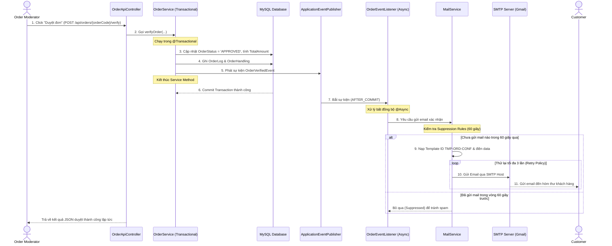

# HƯỚNG DẪN TRIỂN KHAI GỬI EMAIL THÔNG BÁO XÁC NHẬN ĐƠN HÀNG & LINK THANH TOÁN

Tài liệu này đóng vai trò hướng dẫn chi tiết (Step-by-step) dành cho lập trình viên để triển khai hệ thống gửi email xác nhận đơn hàng và link thanh toán trong hệ thống **Bonsai Shop Management System (BSMS)**. Các giải pháp và kiến trúc dưới đây được thiết kế bám sát tài liệu đặc tả thiết kế hệ thống (SDS - System Design Specification).

---

## 🛠️ 1. PHÂN TÍCH KIẾN TRÚC & LUỒNG DỮ LIỆU

### 1.1 Thư viện sử dụng
Hệ thống sử dụng **Spring Boot Starter Mail** (đã cấu hình sẵn trong file [pom.xml](file:///d:/project/Bonsai_Shop/pom.xml)) làm thư viện lõi. Thư viện này cung cấp interface `JavaMailSender` giúp dễ dàng cấu hình và tương tác với SMTP Server của Google (Gmail Sandbox) hoặc các nhà cung cấp mail khác.

### 1.2 Tại sao gửi Email phải nằm ngoài Transactional Boundary (SDS Part 6.2.2)?
Trong Spring Boot, annotation `@Transactional` tự động bắt đầu một database transaction, chiếm giữ 1 Database Connection từ Connection Pool và thực hiện khóa (lock) dữ liệu trên các bảng liên quan cho đến khi phương thức kết thúc và dữ liệu được commit. 

Việc gửi email thông báo **bắt buộc phải nằm ngoài** Transactional Boundary vì các lý do sau:
1. **Tránh nghẽn hàng đợi kết nối (Connection Pool Exhaustion)**: Việc gọi một dịch vụ mạng bên ngoài (gửi qua SMTP Server của Google) là một tác vụ I/O chậm (thường mất từ 1 - 5 giây). Nếu gọi trực tiếp bên trong `@Transactional`, Database Connection sẽ bị treo và không được giải phóng. Khi lưu lượng truy cập cao, Connection Pool sẽ cạn kiệt, dẫn đến sập hệ thống (Timeout/Service Unavailable).
2. **Ngăn chặn tác dụng phụ (Side-effects) khi Rollback**: Email là một hành động không thể "hồi phục" (rollback) một khi đã gửi đi. Nếu bạn gửi email trong Transaction, nhưng sau đó xảy ra lỗi ghi DB hoặc commit thất bại khiến dữ liệu bị rollback, khách hàng vẫn sẽ nhận được email xác nhận đơn hàng thành công mặc dù thực tế đơn hàng đó chưa được tạo/xử lý.
3. **Độc lập lỗi (Failure Isolation)**: Nếu lưu DB thành công nhưng kết nối SMTP gặp sự cố, hệ thống không nên rollback đơn hàng của khách hàng. Việc gửi email thất bại chỉ nên ghi nhận và xử lý lại sau (Retry), không được ảnh hưởng đến tính toàn vẹn của nghiệp vụ duyệt đơn hàng chính.

**Giải pháp**: Sử dụng cơ chế sự kiện **Spring ApplicationEventPublisher** kết hợp với `@TransactionalEventListener(phase = TransactionPhase.AFTER_COMMIT)` và `@Async`. Khi đó, sự kiện gửi mail chỉ được kích hoạt **sau khi** transaction ghi cơ sở dữ liệu đã commit thành công hoàn toàn, và chạy bất đồng bộ trên một luồng (thread) độc lập mà không chặn yêu cầu của người dùng.

---

### 1.3 Luồng dữ liệu (Data Flow)

Dưới đây là sơ đồ luồng dữ liệu từ khi Moderator thực hiện duyệt đơn đến khi email được gửi đi thành công:



---

## 📝 2. HƯỚNG DẪN TRIỂN KHAI TỪNG BƯỚC (STEP-BY-STEP)

Thực hiện các bước sau để cấu hình và lập trình chức năng gửi mail:

### Bước 1: Kích hoạt tính năng chạy bất đồng bộ (Async)
Để cho phép sử dụng `@Async` giúp chạy tác vụ gửi mail trên luồng riêng biệt, bạn cần thêm annotation `@EnableAsync` vào lớp cấu hình hoặc lớp chạy chính của ứng dụng Spring Boot.

Mở file chính của ứng dụng (ví dụ: `BonsaiShopApplication.java` nằm tại thư mục `src/main/java/com/example/bonsai_shop/`) và bổ sung annotation như sau:

```java
package com.example.bonsai_shop;

import org.springframework.boot.SpringApplication;
import org.springframework.boot.autoconfigure.SpringBootApplication;
import org.springframework.scheduling.annotation.EnableAsync;

@SpringBootApplication
@EnableAsync // <-- KÍCH HOẠT CHẠY ASYNC
public class BonsaiShopApplication {
    public static void main(String[] args) {
        SpringApplication.run(BonsaiShopApplication.class, args);
    }
}
```

---

### Bước 2: Khai báo cấu hình SMTP trong `application.properties`
Mở file [application.properties](file:///d:/project/Bonsai_Shop/src/main/resources/application.properties) và đảm bảo các thông số SMTP được định nghĩa đầy đủ. Bạn có thể sử dụng thông tin cấu hình Gmail Sandbox có sẵn dưới đây:

```properties
# ================================================
# EMAIL CONFIG (Sử dụng Gmail SMTP)
# ================================================
spring.mail.host=smtp.gmail.com
spring.mail.port=587
spring.mail.username=buinamkha2004@gmail.com
# Mật khẩu ứng dụng (App Password) gồm 16 ký tự do Google cấp
spring.mail.password=vrfriuwfdwlhmaev 
spring.mail.properties.mail.smtp.auth=true
spring.mail.properties.mail.smtp.starttls.enable=true
spring.mail.properties.mail.smtp.starttls.required=true

# Thiết lập timeout để tránh treo luồng gửi mail khi mất kết nối mạng
spring.mail.properties.mail.smtp.connectiontimeout=5000
spring.mail.properties.mail.smtp.timeout=5000
spring.mail.properties.mail.smtp.writetimeout=5000
```

---

### Bước 3: Định nghĩa Event Class `OrderVerifiedEvent`
Tạo một lớp sự kiện đơn giản dùng để đóng gói thông tin đơn hàng sau khi được duyệt. 

Tạo file mới tại đường dẫn: `src/main/java/com/example/bonsai_shop/product/event/OrderVerifiedEvent.java`

```java
package com.example.bonsai_shop.product.event;

import com.example.bonsai_shop.entity.Order;
import lombok.Getter;

@Getter
public class OrderVerifiedEvent {
    private final Order order;

    public OrderVerifiedEvent(Order order) {
        this.order = order;
    }
}
```

---

### Bước 4: Viết Service Gửi Mail `MailService`
Lớp này chịu trách nhiệm:
1. Nhận yêu cầu gửi email cho đơn hàng.
2. Kiểm tra **Suppression Rules**: Nếu đơn hàng có yêu cầu gửi trùng lặp trong vòng 60 giây, yêu cầu thứ hai sẽ bị bỏ qua.
3. Thiết lập nội dung HTML theo mẫu thiết kế **Template ID: TMP-ORD-CONF** (Part 6.4.2).
4. Áp dụng **Retry Policy**: Nếu gửi lỗi, thử lại tối đa 3 lần, mỗi lần cách nhau 2 giây.

Tạo file mới tại đường dẫn: `src/main/java/com/example/bonsai_shop/product/service/MailService.java`

```java
package com.example.bonsai_shop.product.service;

import com.example.bonsai_shop.entity.Order;
import com.example.bonsai_shop.entity.OrderDetail;
import jakarta.mail.internet.MimeMessage;
import lombok.RequiredArgsConstructor;
import lombok.extern.slf4j.Slf4j;
import org.springframework.mail.javamail.JavaMailSender;
import org.springframework.mail.javamail.MimeMessageHelper;
import org.springframework.stereotype.Service;

import java.time.Instant;
import java.util.Map;
import java.util.concurrent.ConcurrentHashMap;

@Service
@RequiredArgsConstructor
@Slf4j
public class MailService {

    private final JavaMailSender mailSender;

    // Lưu lịch sử gửi mail của từng đơn hàng để kiểm soát Suppression Rule (luồng an toàn ConcurrentHashMap)
    private final Map<String, Instant> suppressionCache = new ConcurrentHashMap<>();

    // Hằng số quy định cấu hình từ thiết kế hệ thống
    private static final String TEMPLATE_ID = "TMP-ORD-CONF";
    private static final int MAX_RETRIES = 3;
    private static final long SUPPRESSION_TIME_SECONDS = 60; // 60 giây chặn trùng lặp

    /**
     * Phương thức gửi email xác nhận đơn hàng kèm link thanh toán
     */
    public void sendOrderConfirmationEmail(Order order) {
        String orderCode = order.getOrderCode();
        String toEmail = order.getCustomerEmail();

        if (toEmail == null || toEmail.trim().isEmpty()) {
            log.warn("Không tìm thấy email của khách hàng cho đơn hàng: {}", orderCode);
            return;
        }

        // 1. Áp dụng Suppression Rule (60 giây)
        Instant now = Instant.now();
        if (suppressionCache.containsKey(orderCode)) {
            Instant lastSent = suppressionCache.get(orderCode);
            long secondsSinceLastSent = now.getEpochSecond() - lastSent.getEpochSecond();
            if (secondsSinceLastSent < SUPPRESSION_TIME_SECONDS) {
                log.info("Suppression Rule Kích hoạt: Đơn hàng {} đã được gửi mail xác nhận {} giây trước. Bỏ qua yêu cầu gửi lại.", 
                        orderCode, secondsSinceLastSent);
                return;
            }
        }

        // Cập nhật mốc thời gian gửi mail mới nhất của đơn hàng này
        suppressionCache.put(orderCode, now);

        // 2. Chuẩn bị nội dung HTML Template (Mẫu ID: TMP-ORD-CONF)
        String paymentLink = "http://localhost:8080/checkout?orderCode=" + orderCode; // Link trang thanh toán
        String emailContent = buildOrderConfirmationTemplate(order, paymentLink);

        // 3. Áp dụng Retry Policy (Gửi lại tối đa 3 lần nếu gặp lỗi kết nối mạng)
        int attempt = 0;
        boolean isSentSuccessfully = false;

        while (attempt < MAX_RETRIES && !isSentSuccessfully) {
            try {
                attempt++;
                log.info("Bắt đầu gửi email xác nhận đơn hàng {} (Lần thử {}/{}) tới: {}", 
                        orderCode, attempt, MAX_RETRIES, toEmail);

                MimeMessage mimeMessage = mailSender.createMimeMessage();
                MimeMessageHelper helper = new MimeMessageHelper(mimeMessage, true, "UTF-8");

                helper.setFrom("buinamkha2004@gmail.com");
                helper.setTo(toEmail);
                helper.setSubject("Xác nhận đơn hàng #" + orderCode + " - Bonsai Shop");
                helper.setText(emailContent, true); // Thiết lập nội dung dạng HTML

                mailSender.send(mimeMessage);
                isSentSuccessfully = true;
                log.info("Đã gửi email xác nhận đơn hàng {} thành công.", orderCode);

            } catch (Exception e) {
                log.error("Lỗi khi gửi email xác nhận đơn hàng {} ở lần thử thứ {}: {}", orderCode, attempt, e.getMessage());
                if (attempt < MAX_RETRIES) {
                    try {
                        // Nghỉ 2 giây trước khi thử lại
                        Thread.sleep(2000);
                    } catch (InterruptedException ie) {
                        Thread.currentThread().interrupt();
                    }
                } else {
                    log.error("Gửi email thất bại hoàn toàn sau {} lần thử đối với đơn hàng: {}", MAX_RETRIES, orderCode);
                }
            }
        }
    }

    /**
     * Helper sinh mã HTML cho Template ID: TMP-ORD-CONF
     */
    private String buildOrderConfirmationTemplate(Order order, String paymentLink) {
        String customerName = order.getCustomerName() != null ? order.getCustomerName() : "Khách hàng";
        
        // Lấy tên cây cảnh trong đơn hàng (Bonsai Shop bán cây độc bản, mỗi đơn hàng có 1 sản phẩm)
        String productName = "Cây cảnh Bonsai cao cấp";
        if (order.getOrderDetails() != null && !order.getOrderDetails().isEmpty()) {
            OrderDetail detail = order.getOrderDetails().get(0);
            if (detail.getProduct() != null) {
                productName = detail.getProduct().getProductName();
            }
        }

        return "<div style=\"font-family: Arial, sans-serif; max-width: 600px; margin: 0 auto; padding: 20px; border: 1px solid #e0e0e0; border-radius: 8px;\">" +
                "  <div style=\"text-align: center; background-color: #2e7d32; color: white; padding: 15px; border-radius: 6px 6px 0 0;\">" +
                "    <h2>Xác Nhận Đơn Hàng & Link Thanh Toán</h2>" +
                "    <p style=\"margin: 0; font-size: 14px;\">Mẫu thiết kế: " + TEMPLATE_ID + "</p>" +
                "  </div>" +
                "  <div style=\"padding: 20px; color: #333333; line-height: 1.6;\">" +
                "    <p>Xin chào <strong>" + customerName + "</strong>,</p>" +
                "    <p>Đơn hàng của bạn đã được kiểm duyệt thành công bởi Đội ngũ kỹ thuật của Bonsai Shop. Dưới đây là thông tin chi tiết đơn hàng:</p>" +
                "    " +
                "    <table style=\"width: 100%; border-collapse: collapse; margin: 15px 0;\">" +
                "      <tr style=\"background-color: #f5f5f5;\">" +
                "        <td style=\"padding: 10px; border: 1px solid #dddddd;\"><strong>Mã đơn hàng:</strong></td>" +
                "        <td style=\"padding: 10px; border: 1px solid #dddddd;\">#" + order.getOrderCode() + "</td>" +
                "      </tr>" +
                "      <tr>" +
                "        <td style=\"padding: 10px; border: 1px solid #dddddd;\"><strong>Sản phẩm cây cảnh:</strong></td>" +
                "        <td style=\"padding: 10px; border: 1px solid #dddddd;\">" + productName + "</td>" +
                "      </tr>" +
                "      <tr style=\"background-color: #f5f5f5;\">" +
                "        <td style=\"padding: 10px; border: 1px solid #dddddd;\"><strong>Phí xe cẩu nâng hạ:</strong></td>" +
                "        <td style=\"padding: 10px; border: 1px solid #dddddd;\">" + order.getCraneFee() + " VND</td>" +
                "      </tr>" +
                "      <tr>" +
                "        <td style=\"padding: 10px; border: 1px solid #dddddd;\"><strong>Phí vận chuyển:</strong></td>" +
                "        <td style=\"padding: 10px; border: 1px solid #dddddd;\">" + order.getShippingFee() + " VND</td>" +
                "      </tr>" +
                "      <tr style=\"background-color: #f5f5f5; font-weight: bold; color: #2e7d32;\">" +
                "        <td style=\"padding: 10px; border: 1px solid #dddddd;\">Tổng chi phí thanh toán:</td>" +
                "        <td style=\"padding: 10px; border: 1px solid #dddddd;\">" + order.getTotalAmount() + " VND</td>" +
                "      </tr>" +
                "    </table>" +
                "    " +
                "    <p>Để hoàn tất quá trình đặt hàng và lên lịch giao cây, vui lòng thực hiện thanh toán trực tuyến bằng cách nhấn vào nút dưới đây:</p>" +
                "    " +
                "    <div style=\"text-align: center; margin: 30px 0;\">" +
                "      <a href=\"" + paymentLink + "\" style=\"background-color: #2e7d32; color: white; padding: 12px 25px; text-decoration: none; font-weight: bold; border-radius: 4px; display: inline-block; box-shadow: 0 4px 6px rgba(0,0,0,0.1);\">" +
                "        TIẾN HÀNH THANH TOÁN" +
                "      </a>" +
                "    </div>" +
                "    " +
                "    <p style=\"font-size: 13px; color: #666666;\"><em>Lưu ý: Link thanh toán này có hiệu lực tối đa trong vòng 24 giờ. Nếu bạn gặp bất cứ khó khăn nào trong quá trình giao dịch, vui lòng liên hệ hotline của chúng tôi để được hỗ trợ kỹ thuật cẩu hạ cây.</em></p>" +
                "  </div>" +
                "  <div style=\"text-align: center; padding: 15px; font-size: 12px; color: #999999; border-top: 1px solid #e0e0e0; background-color: #fafafa;\">" +
                "    © " + java.time.LocalDate.now().getYear() + " Bonsai Shop Management System. All rights reserved." +
                "  </div>" +
                "</div>";
    }
}
```

---

### Bước 5: Tạo Event Listener `OrderEventListener`
Lớp Listener này dùng để bắt sự kiện duyệt đơn hàng và gọi sang `MailService`. Nhờ việc sử dụng các annotation của Spring, lớp này sẽ chạy ngoài Transaction của `OrderService`.

Tạo file mới tại đường dẫn: `src/main/java/com/example/bonsai_shop/product/event/OrderEventListener.java`

```java
package com.example.bonsai_shop.product.event;

import com.example.bonsai_shop.product.service.MailService;
import lombok.RequiredArgsConstructor;
import lombok.extern.slf4j.Slf4j;
import org.springframework.context.event.EventListener;
import org.springframework.scheduling.annotation.Async;
import org.springframework.stereotype.Component;
import org.springframework.transaction.event.TransactionPhase;
import org.springframework.transaction.event.TransactionalEventListener;

@Component
@RequiredArgsConstructor
@Slf4j
public class OrderEventListener {

    private final MailService mailService;

    /**
     * Lắng nghe sự kiện OrderVerifiedEvent.
     * 1. @TransactionalEventListener(phase = TransactionPhase.AFTER_COMMIT) giúp đảm bảo sự kiện
     *    chỉ được kích hoạt khi transaction của Service duyệt đơn hoàn tất commit thành công vào Database.
     * 2. @Async cấu hình cho phương thức này chạy bất đồng bộ trên luồng riêng, không block API Response chính.
     */
    @Async
    @TransactionalEventListener(phase = TransactionPhase.AFTER_COMMIT)
    public void handleOrderVerifiedEvent(OrderVerifiedEvent event) {
        log.info("Nhận sự kiện duyệt đơn hàng thành công cho mã: {}. Bắt đầu chuyển tiếp sang Mail Service.", 
                event.getOrder().getOrderCode());
        mailService.sendOrderConfirmationEmail(event.getOrder());
    }
}
```

---

### Bước 6: Tích hợp phát sự kiện (Event Publishing) vào UC-07 trong `OrderService`
Tại phương thức `verifyOrder` xử lý nghiệp vụ duyệt đơn hàng (thuộc Use Case UC-07: Process Customer Orders) trong lớp `OrderService.java`, tiến hành tiêm `ApplicationEventPublisher` và gọi phát sự kiện ngay cuối phương thức.

Mở file [OrderService.java](file:///d:/project/Bonsai_Shop/src/main/java/com/example/bonsai_shop/product/service/OrderService.java) và thực hiện các chỉnh sửa sau:

1. Thêm import lớp sự kiện và event publisher:
   ```java
   import org.springframework.context.ApplicationEventPublisher;
   import com.example.bonsai_shop.product.event.OrderVerifiedEvent;
   ```
2. Khai báo dependency `ApplicationEventPublisher` (Lombok `@RequiredArgsConstructor` sẽ tự động tạo Constructor injection cho trường `private final` này):
   ```java
   private final ApplicationEventPublisher eventPublisher;
   ```
3. Bổ sung mã lệnh kích hoạt sự kiện ngay trước câu lệnh `return true;` trong hàm `verifyOrder`:
   ```java
       @Transactional
       public boolean verifyOrder(String orderCode, BigDecimal craneFee, BigDecimal shippingFee, User moderator) {
           Order order = orderRepository.findByOrderCode(orderCode).orElse(null);
           if (order == null || !"PENDING".equals(order.getOrderStatus())) {
               return false;
           }

           String oldStatus = order.getOrderStatus();

           // 1. Cập nhật phí xe cẩu, phí vận chuyển và trạng thái duyệt
           order.setCraneFee(craneFee);
           order.setShippingFee(shippingFee);
           order.setOrderStatus("APPROVED");

           // 2. Tính lại tổng tiền: totalAmount = Tiền cây gốc + phí cẩu + phí ship
           BigDecimal originalAmount = order.getTotalAmount();
           BigDecimal newTotal = originalAmount.add(craneFee).add(shippingFee);
           order.setTotalAmount(newTotal);

           orderRepository.save(order);

           // 3. Ghi OrderLog nhật ký hoạt động
           OrderLog log = OrderLog.builder()
                   .order(order)
                   .actionBy(moderator)
                   .actionType("VERIFY")
                   .fromStatus(oldStatus)
                   .toStatus("APPROVED")
                   .actionAt(LocalDateTime.now())
                   .build();
           orderLogRepository.save(log);

           // 4. Lưu OrderHandling
           OrderHandling handling = OrderHandling.builder()
                   .order(order)
                   .moderator(moderator)
                   .handledAt(LocalDateTime.now())
                   .isActive(true)
                   .build();
           orderHandlingRepository.save(handling);

           // 5. Phát sự kiện xác nhận đơn hàng để chuẩn bị gửi Email ngoài Transaction Boundary
           eventPublisher.publishEvent(new OrderVerifiedEvent(order));

           return true;
       }
   ```

---

## 🔍 3. HƯỚNG DẪN KIỂM THỬ VÀ XÁC MINH (VERIFICATION)

Để đảm bảo hệ thống gửi email hoạt động ổn định và chính xác theo thiết kế, bạn hãy thực hiện kiểm thử theo các kịch bản sau:

### Kịch bản 1: Kiểm thử luồng gửi email thành công
1. Đăng nhập vào hệ thống dưới quyền tài khoản **Order Moderator**.
2. Truy cập vào màn hình quản lý đơn hàng `/moderator/orders`.
3. Tìm một đơn hàng có trạng thái là **PENDING** và nhấp chọn dòng đơn hàng để hiển thị Drawer chi tiết.
4. Điền thông tin Phí xe cẩu (ví dụ: `150,000 VND`), Phí vận chuyển (ví dụ: `50,000 VND`) và nhấn nút **Phê duyệt đơn hàng**.
5. Kiểm tra log của ứng dụng trong Terminal. Bạn sẽ thấy dòng log xác nhận transaction đã commit, sau đó kích hoạt Listener chạy bất đồng bộ trên luồng mới (ví dụ: `task-1` hoặc `SimpleAsyncTaskExecutor-1`), và in ra:
   `Bắt đầu gửi email xác nhận đơn hàng ... (Lần thử 1/3) tới ...`
   `Đã gửi email xác nhận đơn hàng ... thành công.`
6. Mở hòm thư cá nhân của khách hàng đã đặt đơn để kiểm tra nội dung Email HTML xem đã hiển thị đầy đủ tiêu đề, chi tiết phí cẩu hạ cây, tổng tiền thanh toán và nút **TIẾN HÀNH THANH TOÁN** chưa.

### Kịch bản 2: Kiểm thử Suppression Rule (Chặn Spam)
1. Thực hiện phê duyệt duyệt đơn hàng trên.
2. Ngay lập tức (trong vòng dưới 60 giây), giả lập hoặc tạo lại một request gửi email cho đơn hàng đó (hoặc click duyệt lại nếu có cơ chế kích hoạt gửi lại mail thủ công).
3. Kiểm tra log ứng dụng, hệ thống phải in ra dòng log dạng:
   `Suppression Rule Kích hoạt: Đơn hàng ... đã được gửi mail xác nhận ... giây trước. Bỏ qua yêu cầu gửi lại.`
4. Đảm bảo hòm thư của khách hàng không bị nhận hai thư trùng lặp cùng một lúc.

### Kịch bản 3: Kiểm thử Retry Policy khi SMTP gặp sự cố
1. Tạm thời chỉnh sửa sai thông tin `spring.mail.password` trong file `application.properties` để mô phỏng lỗi xác thực SMTP.
2. Thực hiện phê duyệt một đơn hàng **PENDING** khác.
3. Quan sát log hệ thống. Bạn sẽ thấy chương trình in ra log lỗi gửi thư lần 1, chờ 2 giây, tự động thử lại lần 2, chờ 2 giây, thử lại lần 3 và sau đó thông báo lỗi gửi thư thất bại hoàn toàn.
4. Kiểm tra Database: Đơn hàng vẫn phải được cập nhật trạng thái **APPROVED** bình thường (dữ liệu không bị rollback) mặc dù việc gửi mail bị thất bại. Điều này chứng minh tác vụ gửi mail đã tách khỏi Transactional Boundary thành công!
